# Proxy inverso

El código de Vagrant para el despliegue sería el siguiente:

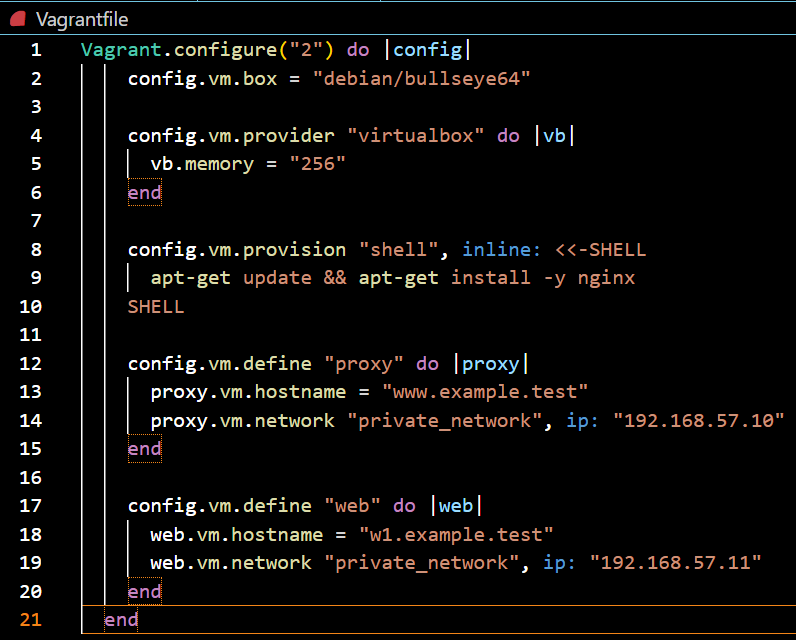

## Configuraremos el servidor *w1* con los siguientes pasos:

### w1

1. `/etc/nginx/sites-available/default`
2. `sudo systemctl restart nginx`
3. `/var/www/html/index.html`
4. `sudo apt install -y curl`
5. 
   
## Nginx *proxy* inverso

### proxy

1. `/etc/hosts`  
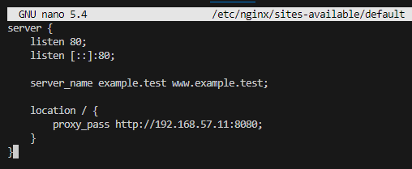
2. `sudo systemctl restart nginx`

3. 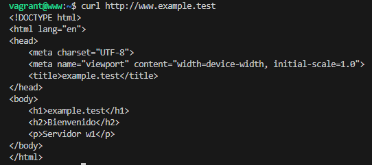

## Logs

1. Accederemos en nuestro navegador a la dirección 192.168.57.10
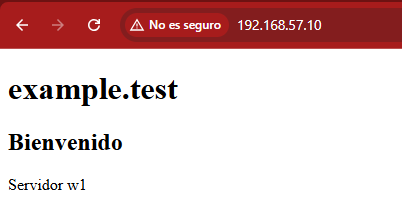
2. Accederemos a los logs de proxy
`sudo tail /var/log/nginx/access.log`
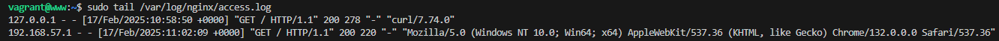
3. Accederemos a los logs de web
`sudo tail /var/log/nginx/access.log`
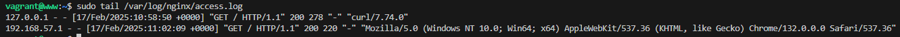

## Cabeceras

1. En Firefox pulsaremos Ctrl+Shift+I u opciones / more tools / Web developer tools. Luego pulsaremos en Network y marcaremos Disable cache.
2. Recargaremos la página y examinaremos la petición (en rojo) dónde se puede ver la respuesta GET HTTP (200 OK)
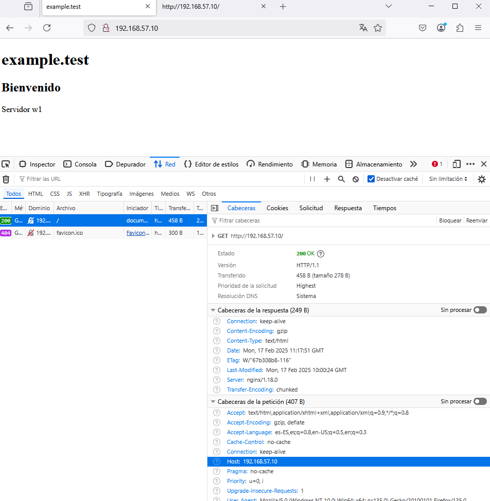
3. Usando DNS
Si accedemos mediante un nombre de host www.192.168.57.10.nip.io, veremos que la cabecera Host cambia. Pruebalo.
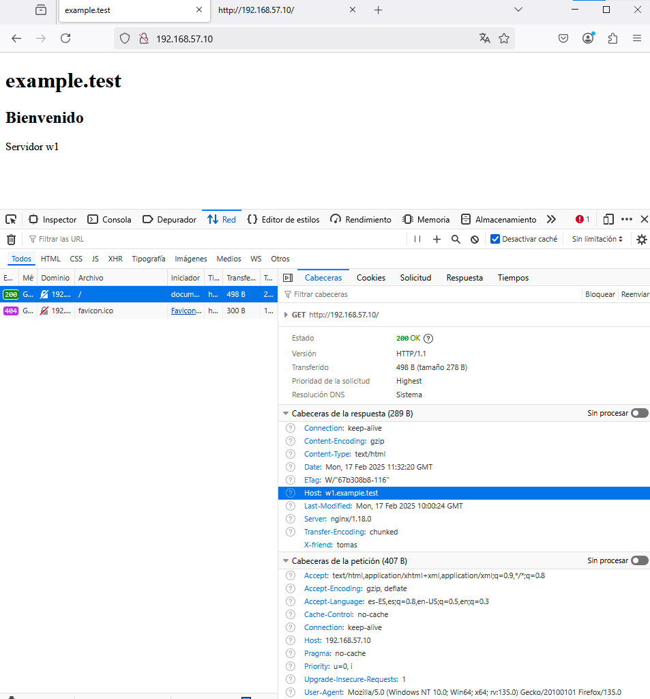

## Añadiendo Cabeceras

1. Para añadir cabeceras, en el archivo de configuración del sitio web de proxy debemos añadir dentro del bloque location / { … } debemos añadir la directiva:
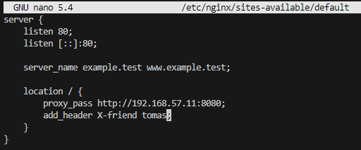
2. `sudo systemctl restart nginx` 
3. Con las herramientas de desarrollador comprobamos que la petición ha pasado por el proxy inverso que ha añadido la cabecera en la respuesta.
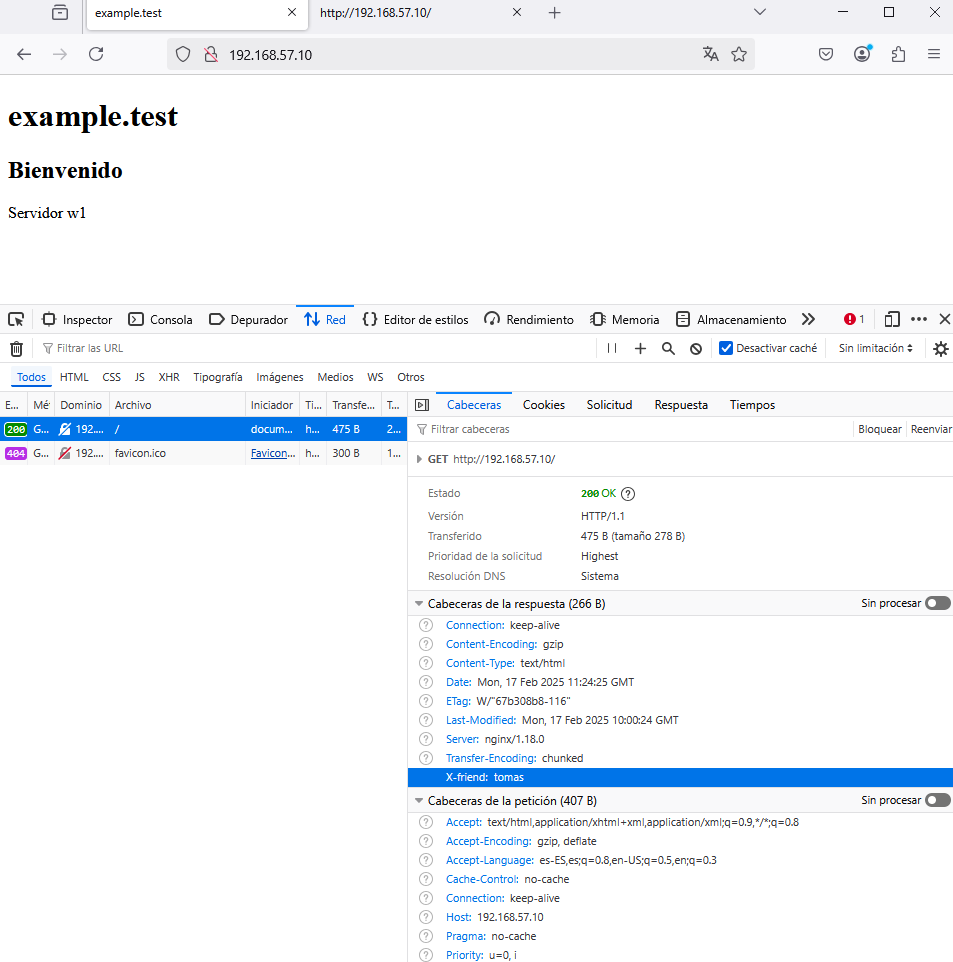

## Cabeceras en el servidor web

1. Añadiremos también una cabecera en el servidor web:
`/etc/nginx/sites-enabled/default de web`
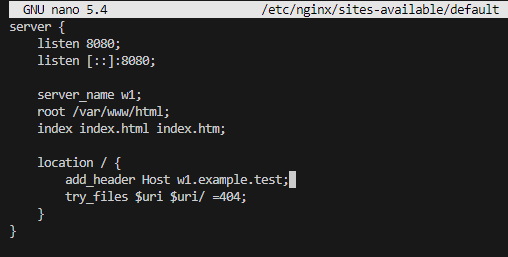
2. `sudo systemctl restart nginx` 
3. 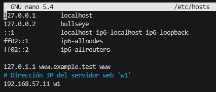

## Ampliación

